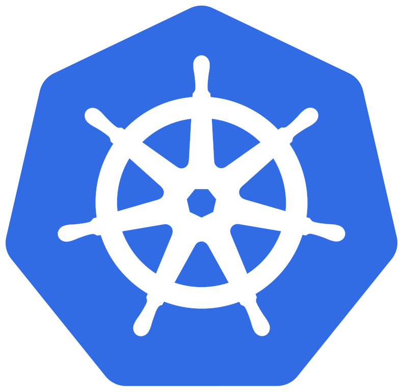

# Carbonetes
안녕하세요 ! 저희는 동아대학교 실증적SW개발프로젝트01 Team Carbonetes 입니다. 
```
문제 정의 - 9번
주제 : 멀티 클러스터 쿠버네티스 환경에서의 탄소 인지형 작업 스케줄러
멘토교수 : 천세진 교수님
```

<br/>
<br/>

# 0. Getting Started (시작하기)
(구현 진행 중)
<br/>
<br/>

# 1. Project Overview (프로젝트 개요)
- 프로젝트 이름: Carbonetes (Carbon Aware + Kubernetes)
- 프로젝트 설명: 멀티 클러스터 쿠버네티스 환경에서의 탄소 인지형 작업 스케줄러 

<br/>
<br/>

# 2. Team Members (팀원 및 팀 소개)
| 박태민 | 채승지 | 정주영 | 하윤지 |
|:------:|:------:|:------:|:------:|
|  |  |  |  |
| 팀장 | 팀원 | 팀원 | 팀원 |
| [GitHub](https://github.com/DLLegs) | [GitHub](https://github.com/ChaeSeungJi) | [GitHub](https://github.com/zzooyoung) | [GitHub](https://github.com/rzl0zi) |

<br/>
<br/>

# 3. Key Features (주요 기능)
- **Web UI 제공**:
  - 태스크를 등록할 수 잇는 Web UI를 제공합니다. 

- **모니터링**:
  - 현재 사용 중인 클러스터 노드 리소스 모니터링 시스템을 제공합니다.

- **태스킹 큐**:
  - 작업을 일괄적으로 등록시, 태스킹 큐에 등록이되며 순차 적으로 디스패치가 진행됩니다. 

- **스케줄링**:
  - 메타 정보를 전부 긁어모아서 어떤 클러스터에 배치시키는 것이 좋을 지 판단하는 스케줄러


<br/>
<br/>

# 4. Tasks & Responsibilities (작업 및 역할 분담)
|  |  |  |
|-----------------|-----------------|-----------------|
| 박태민    |   | <ul><li>프로젝트 계획 및 관리</li><li>팀 리딩 및 커뮤니케이션</li><li>모니터링 시스템 개발</li><li>컴퓨팅 리소스 수집기 구축</li><li>탄소집약도 수집기 구축</li></ul>     |
| 채승지   |  | <ul><li>쿠버네티스 클러스터 구축</li><li>디스패쳐 제작</li><li>작업시간 추정기 개발</li><li>오퍼레이터 개발</li></ul> |
| 정주영   |      |<ul><li>작업 스케줄러 개발</li><li>스케줄링 기법 고안</li><li>기존 스케줄러 분석</li></ul>  |
| 하윤지    |      | <ul><li>Web UI 제작</li><li>선행 연구 분석</li><li>데이터베이스 관리</li></ul>    |

<br/>
<br/>

# 5. Technology Stack (기술 스택)
## 5.1 DevOps
|  |  |
|-----------------|-----------------|
| Kubernetes    || 

<br/>

## 5.2 Frotend
|  |  |  |
|-----------------|-----------------|-----------------|
| React    |   | 18.3.1    |

<br/>

## 5.3 Backend
|  |  |  |
|-----------------|-----------------|-----------------|
| Flask    |      | 10.12.5    |

<br/>

## 5.4 Cooperation
|  |  |
|-----------------|-----------------|
| Git    |      |
| Notion    |      |

<br/>

# 6. Project Structure (프로젝트 구조)
```plaintext
(작성예정)
```

<br/>
<br/>

# 7. Development Workflow (개발 워크플로우)
## 브랜치 전략 (Branch Strategy)
우리의 브랜치 전략은 Git Flow를 기반으로 하며, 다음과 같은 브랜치를 사용합니다.

- Main Branch
  - 배포 가능한 상태의 코드를 유지합니다.
  - 모든 배포는 이 브랜치에서 이루어집니다.
  
- {name} Branch
  - 팀원 각자의 개발 브랜치입니다.
  - 모든 기능 개발은 이 브랜치에서 이루어집니다.

<br/>
<br/>

# 8. Coding Convention
## 문장 종료
```
// 세미콜론(;)
console.log("Hello World!");
```

<br/>


## 명명 규칙
* 상수 : 영문 대문자 + 스네이크 케이스
```
const NAME_ROLE;
```
* 변수 & 함수 : 카멜케이스
```
// state
const [isLoading, setIsLoading] = useState(false);
const [isLoggedIn, setIsLoggedIn] = useState(false);
const [errorMessage, setErrorMessage] = useState('');
const [currentUser, setCurrentUser] = useState(null);

// 배열 - 복수형 이름 사용
const datas = [];

// 정규표현식: 'r'로 시작
const = rName = /.*/;

// 이벤트 핸들러: 'on'으로 시작
const onClick = () => {};
const onChange = () => {};

// 반환 값이 불린인 경우: 'is'로 시작
const isLoading = false;

// Fetch함수: method(get, post, put, del)로 시작
const getEnginList = () => {...}
```

<br/>

## 블록 구문
```
// 한 줄짜리 블록일 경우라도 {}를 생략하지 않고, 명확히 줄 바꿈 하여 사용한다
// good
if(true){
  return 'hello'
}

// bad
if(true) return 'hello'
```

<br/>


## 폴더 네이밍
카멜 케이스를 기본으로 하며, 컴포넌트 폴더일 경우에만 파스칼 케이스로 사용한다.
```
// 카멜 케이스
camelCase
// 파스칼 케이스
PascalCase
```

<br/>

## 파일 네이밍
```
```

<br/>
<br/>

# 9. 커밋 컨벤션
## 기본 구조
```
type : subject

body 
```

<br/>

## type 종류
```
feat : 새로운 기능 추가
fix : 버그 수정
docs : 문서 수정
style : 코드 포맷팅, 세미콜론 누락, 코드 변경이 없는 경우
refactor : 코드 리펙토링
test : 테스트 코드, 리펙토링 테스트 코드 추가
chore : 빌드 업무 수정, 패키지 매니저 수정
```

<br/>

## 커밋 예시
```
== ex1
✨Feat: "회원 가입 기능 구현"

SMS, 이메일 중복확인 API 개발

== ex2
📚chore: styled-components 라이브러리 설치

UI개발을 위한 라이브러리 styled-components 설치
```

<br/>
<br/>

# 10. 컨벤션 수행 결과
(작성 예정)
예시))
